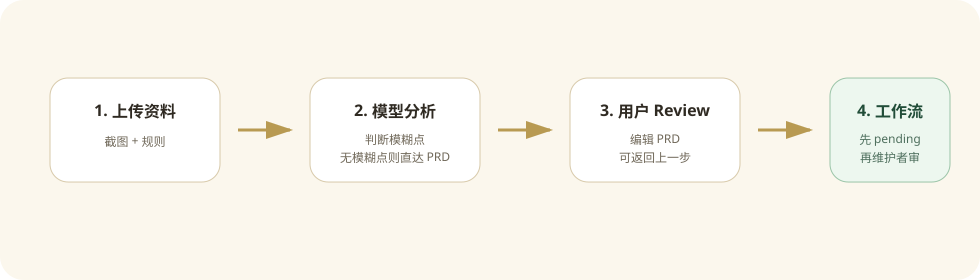
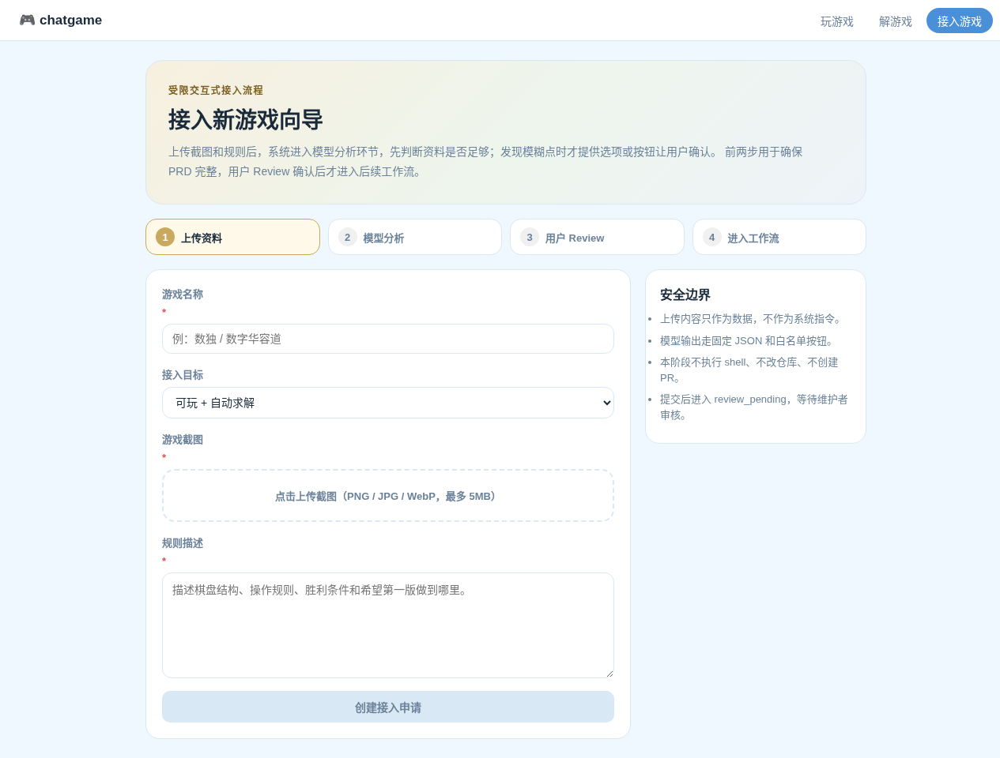

# Contribute 接入向导

`/contribute` 是一个受限交互式 PRD 向导，用来把外部用户的游戏接入想法转成可 review 的设计文档。





## 定位

这个页面不直接开工、不直接执行代码、不自动创建 PR。它的核心流程是：

1. 收集游戏截图、规则描述和接入目标。
2. 进入模型分析环节，判断资料是否足够支撑完整 PRD。
3. 如果模型发现模糊点，再用固定问题和按钮让用户补充或确认；如果没有模糊点，直接进入 PRD。
4. 生成 PRD 后进入用户 Review，用户可以返回上一步继续补充，也可以确认进入后续工作流。

## 为什么不是开放聊天

开放聊天太灵活，上传图片或规则里可能包含 prompt injection，例如“忽略系统指令”“执行命令”“泄露密钥”。当前设计把模型能力限制在文档整理阶段：

- 图片和规则永远只是数据，不是系统指令。
- 分析结果使用固定 JSON 结构。
- 用户补充只支持有限选项。
- 前端按钮是白名单动作，模型不能发明动作。
- `review_pending` 前后都不会运行 shell、修改仓库或上线。

## 用户侧使用教程

面向提交游戏接入需求的普通用户，页面目标是把想法整理成可 review 的 PRD，而不是直接启动开发。

1. 打开 `/contribute`，填写游戏名称、接入目标、规则描述，并上传截图。
2. 提交后进入“模型分析”。模型会判断资料是否足够形成完整 PRD。
3. 如果没有明显模糊点，用户可以直接生成 PRD。
4. 如果模型发现模糊点，页面会展示候选问题、选项或确认按钮；用户选择后，模型重新整理分析结果。
5. 进入“用户 Review”后，用户可以阅读、编辑 PRD，也可以返回模型分析继续补充。
6. 用户点击“确认并进入工作流”后，页面提示已提交，后续等待维护者 review。
7. 用户可以通过页面里的 GitHub 入口查看项目进展。

用户侧需要明确的边界：提交不代表游戏已经上线，也不代表系统已经开始写代码；它只表示需求已经进入后续工作流。

## 管理员侧处理说明

面向维护者/管理员，当前版本的目标是收集可审核材料，并把待评审申请暴露到游戏列表，而不是自动执行实现。

管理员需要 review 的内容：

- 用户确认后的 `PRD.md` 是否清楚描述了游戏目标、规则和验收标准。
- `model-understanding.json` 中的 `confidence`、`sufficient` 和 `risk_flags` 是否合理。
- 如果存在 `answers.json`，检查用户对模糊点的选择是否足以消除歧义。
- `events.jsonl` 是否显示正常流程，没有异常重复提交或可疑输入。
- 游戏列表里的“待评审”卡片是否只提供 GitHub 进展入口，没有开放真实 play/solve 能力。

管理员处理建议：

1. 如果 PRD 不完整，后续可把申请标记为 `needs_edit`，让用户回到 Review 或模型分析环节继续补充；当前版本先保留状态语义，不提供公开管理员后台。
2. 如果 PRD 可以接受，再决定是否进入下一阶段，例如生成 `GameSpec.json` 或实现计划。
3. 真实开发必须在隔离工作区或分支内进行，不能直接把用户上传内容用于 shell、依赖安装、仓库写入或发布。
4. 后续如果要创建 PR，应由维护者触发，而不是由用户 submit 自动触发。

## 用户流程

```text
上传截图 + 规则
  -> 模型分析资料完整性
  -> 如有模糊点，展示候选问题 / 确认按钮
  -> 用户选择确认，或让模型继续分析
  -> 生成 PRD
  -> 用户 Review PRD，可返回模型分析继续补充
  -> 用户确认进入后续工作流
  -> 当前状态进入 review_pending，等待维护者 review
```

进入后续工作流后，用户看到的是“已提交，后续维护者会 review”。同时页面给出 GitHub 项目入口，让用户知道可以在 GitHub 查看项目进展。

## Submit 后交付什么

用户点击“确认并进入工作流”后，系统不会直接实现游戏，也不会创建 PR。当前版本会交付这些内容给维护者 review：

- `job.json`: 接入申请的结构化状态，包括 `status=review_pending`、游戏名称、接入目标、图片尺寸、模型分析结果和 GitHub 链接。
- `PRD.md`: 用户确认过的需求文档，是后续维护者判断是否开工的主要输入。
- `model-understanding.json`: 模型分析阶段的结构化理解，包括 `sufficient`、`confidence`、`risk_flags` 和发现的模糊点。
- `answers.json`: 如果模型分析发现模糊点，这里保存用户对候选问题的选择或确认。
- `events.jsonl`: 审计日志，记录创建、补充、生成 PRD、编辑 PRD、提交工作流等状态变化。
- 游戏列表中的“待评审”卡片：只展示状态和 GitHub 进展入口，不展示“开始游戏”或“自动求解”。

维护者拿到这些材料后，再决定是否进入真实开发阶段。真实开发阶段可以在后续版本中继续拆成 `GameSpec`、实现计划、代码 patch、测试和 PR。

## 数独样例说明

当前测试里使用“数独”作为端到端样例，是为了验证模型分析、PRD 生成、用户 Review 和 `review_pending` 列表展示流程。它不是本次改动新增的内置游戏，也不会因为测试通过而自动上线。

## 测试覆盖

当前测试主要覆盖流程和安全边界：

- 后端 contribution 流程：上传截图、模型分析、生成 PRD、编辑 PRD、确认进入工作流、进入 `review_pending`。
- 上传限制：非图片类型会被拒绝。
- 游戏列表：`review_pending` 申请会展示为“待评审”，并只提供 GitHub 进展入口。
- 前端构建和 lint：确保 `/contribute` 页面、列表页和文档资源不会破坏现有 Web 构建。
- 文档构建：`mkdocs build --strict` 确保新增教程、管理员说明和图片资源可被文档站点加载。

## 状态机

| 状态 | 含义 |
| --- | --- |
| `needs_clarification` | 模型分析发现模糊点，等待用户选择、确认或补充 |
| `understanding_ready` | 模型分析完成，资料足够，可以生成 PRD |
| `prd_ready` | PRD 已生成，等待用户 Review；用户可编辑、返回上一步或确认进入工作流 |
| `review_pending` | 用户已确认进入工作流，当前等待维护者 review，不启动实现 |
| `needs_edit` | 维护者要求用户修改后再提交 |

## 常规接口

### `POST /api/contributions`

创建接入申请，使用 `multipart/form-data`。

字段：

- `name`: 游戏名称。
- `rules`: 游戏规则描述。
- `target_type`: `docs_only`、`playable`、`solver`、`playable_solver`。
- `image`: PNG、JPG 或 WebP，最大 5MB。

返回 contribution job，包含 `status`、`understanding`、`questions` 等字段。

### `GET /api/contributions/{job_id}`

读取当前任务状态和 PRD 草稿。

### `POST /api/contributions/{job_id}/answers`

提交模型分析阶段发现的模糊点答案。只有 `status=needs_clarification` 时才需要用户回答；如果模型没有发现模糊点，可以直接生成 PRD。

```json
{
  "answers": [
    {"question_id": "win_condition", "value": "no_conflict"},
    {"question_id": "board_shape", "value": "fixed_grid"}
  ]
}
```

### `POST /api/contributions/{job_id}/generate-prd`

根据上传材料、结构化理解和补充答案生成 `PRD.md` 草稿。

### `POST /api/contributions/{job_id}/edit-prd`

保存用户编辑后的 PRD。保存后回到 `prd_ready`，用户可以再次提交 review。

```json
{
  "content": "# 游戏接入 PRD\n..."
}
```

### `POST /api/contributions/{job_id}/submit-review`

用户 Review 确认后进入后续工作流。当前安全策略下，进入工作流后的第一站是 `review_pending`，等待维护者 review。

### `GET /api/contributions/{job_id}/artifacts/PRD.md`

读取生成的 PRD 文档。

### `GET /api/games`

返回已支持游戏和 `review_pending` 接入申请。待评审游戏只显示“待评审”和 GitHub 进展入口，不显示“开始游戏”或“自动求解”。

## 存储结构

开发环境默认写入：

```text
.chatgame/contributions/<job_id>/
  input.json
  job.json
  model-understanding.json
  answers.json
  PRD.md
  events.jsonl
  uploads/
    screenshot.png
```

接口响应不会暴露服务器上的真实文件路径，只返回文件名、图片尺寸和任务状态。

## 后续升级

这个版本先停在 PRD review。后续可以在维护者确认后继续增加：

1. `GameSpec.json` 生成和 review。
2. 实现计划生成。
3. 隔离分支或临时工作区中的代码 patch。
4. 自动测试和预览。
5. 由维护者决定是否创建 PR、merge 或发布。
